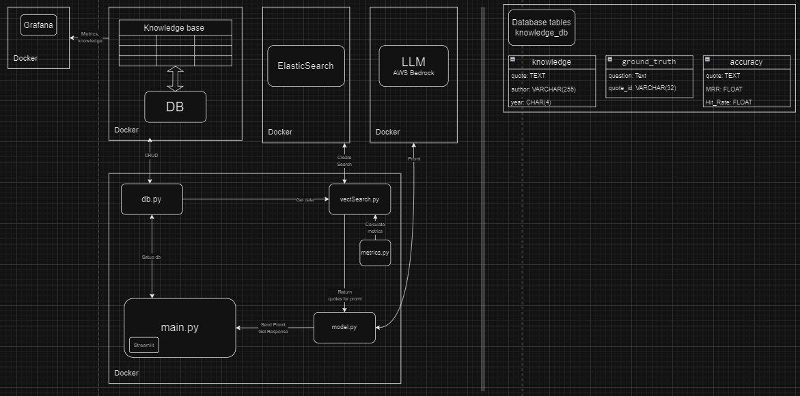
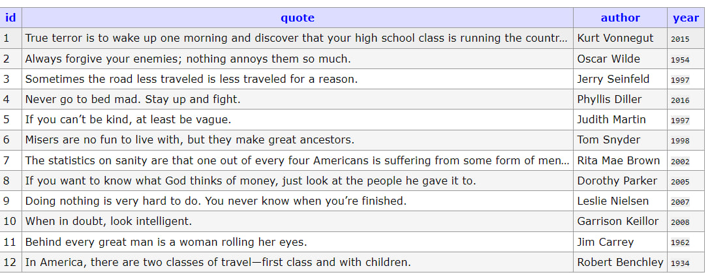
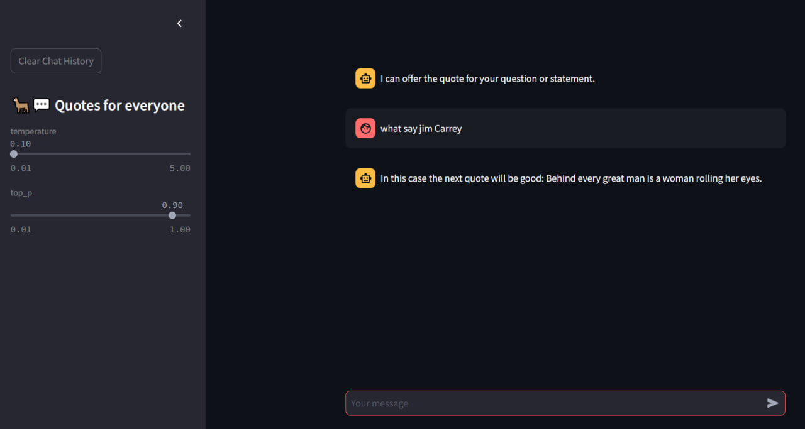
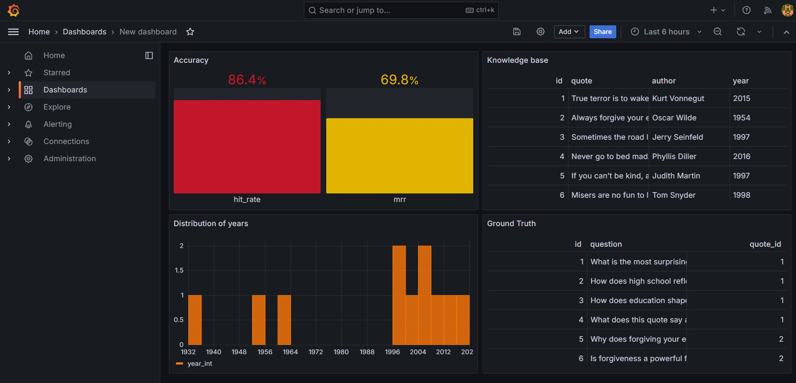

# Project: Creating a Chatbot using Retrieval-Augmented Generation (RAG) for Famous Quotes Search

## Project Goal:
To develop a chatbot that leverages Retrieval-Augmented Generation (RAG) technology to provide the most relevant quotes from famous historical, philosophical, scientific, or cultural figures in response to user queries.

## Description and Key Features:

### RAG (Retrieval-Augmented Generation):
RAG combines two approaches:

- **Retrieval**: Used to search for the most relevant documents or texts (in this case, a collection of quotes).
- **Generation**: Responsible for processing the user's query and presenting an appropriate response based on the retrieved data. This improves accuracy, as relevant information is first retrieved, and then the response is generated.

In this project, RAG will help the user find a quote that best matches their question or statement.

### Data Source:
The quotes will be gathered from various reputable sources, such as:

- Databases of famous quotes from philosophers, scientists, writers, politicians, and more.
- Open, authoritative sources. All quotes will be structured and tagged with metadata like author, context, date, or topic to enable efficient search and filtering.

### Handling User Queries:
Users can input queries in the form of questions or statements. The chatbot will use these queries to search for relevant quotes. For example:

- **Questions**: "What have great people said about love?" or "How to overcome challenges?"
- **Statements**: "I feel lonely" or "Success comes with experience."

### Searching and Matching Algorithms:
- **Quote Ranking**: Quotes will be ranked based on their relevance using text similarity between the query and the quote. Transformer models (e.g., BERT or Sentence-BERT) may be employed to find the best matches.
- **Semantic Search**: Instead of simple keyword matching, the bot will use semantic search to find quotes relevant not only by words but also by meaning.


## Project Structure Description:



### app/data:
This folder contains the main data for the project:
- **data.json**: This file contains famous quotes from well-known individuals, which are used for search and display to the user.
- **ground_truth.csv**: This file contains data for model quality evaluation, representing a dataset necessary for calculating accuracy metrics.

### Python Files in the app Folder:
- **db.py**: Handles establishing and maintaining the connection to the Postgres database. The database is set up using Docker Compose, and this file performs necessary actions to interact with it (CRUD operations).


  
- **metrics.py**: This file implements five different metrics for evaluating the model's performance. It performs calculations based on data from **ground_truth.csv**, comparing query results with the actual values.

- **vectSearch.py**: Responsible for creating and managing the **Elasticsearch** database. It also contains functions for performing search queries in Elasticsearch and generating prompts for interacting with the model and retrieving relevant results.

- **model.py**: Contains the code to connect to the model deployed on **AWS Bedrock**. This file processes requests from the model, generating responses based on data retrieved from **Elasticsearch** and other sources.

- **main.py**: The main file for running the project. It creates a graphical application using **Streamlit**, which serves as the user interface. This file also initializes the Postgres and Elasticsearch databases and launches the entire project infrastructure.



### elasticsearch/Dockerfile:
A **Dockerfile** for configuring and launching Elasticsearch using Docker.

### grafana:

- **grafana_dashboards.yaml** and **grafana_datasources.yaml**: These files are responsible for configuring **Grafana**, a popular monitoring tool. They define the data sources and set up graphs.
- In the **dashboards** folder, files for visualizing data, monitoring, and displaying metrics are located.

### docker-compose.yaml:
The main file for deploying all necessary services using Docker. It defines containers for **Postgres**, **Elasticsearch**, **App**, **Adminer** (a web interface for database management), and **Grafana**.

## Architecture:
The project represents a complex system involving interactions between several components:
- **Postgres** for storing data and managing transactions.
- **Elasticsearch** for performing quote searches.
- **AWS Bedrock** for working with the text generation model.
- **Streamlit** for providing the user interface.
- **Grafana** for monitoring and analyzing performance.

## Workflow:
When the application is launched on **Streamlit**, the Postgres and Elasticsearch databases are initialized. Users can input queries through the interface, and the system uses **Elasticsearch** to perform the search and **AWS Bedrock** to generate responses, providing relevant quotes. The quality metrics are calculated based on data from **ground_truth.csv**, and system performance monitoring is carried out using **Grafana**.

## How to Run the Application

1. **Prepare the Data:**
   - Place the quotes data in `app/data.json`, ensuring that it follows the required format.
   - Place the quality evaluation data in `app/ground_truth_data.csv` to be used for assessing search quality.

2. **Start the Project:**
   - Run the following command to build and start the project:
     ```bash
     docker compose up --build
     ```


3. **Access the Application:**
   - Once the project is running, open your browser and navigate to:
     ```
     localhost:8501
     ```

   You should see the Streamlit application interface where you can start interacting with the chatbot.


